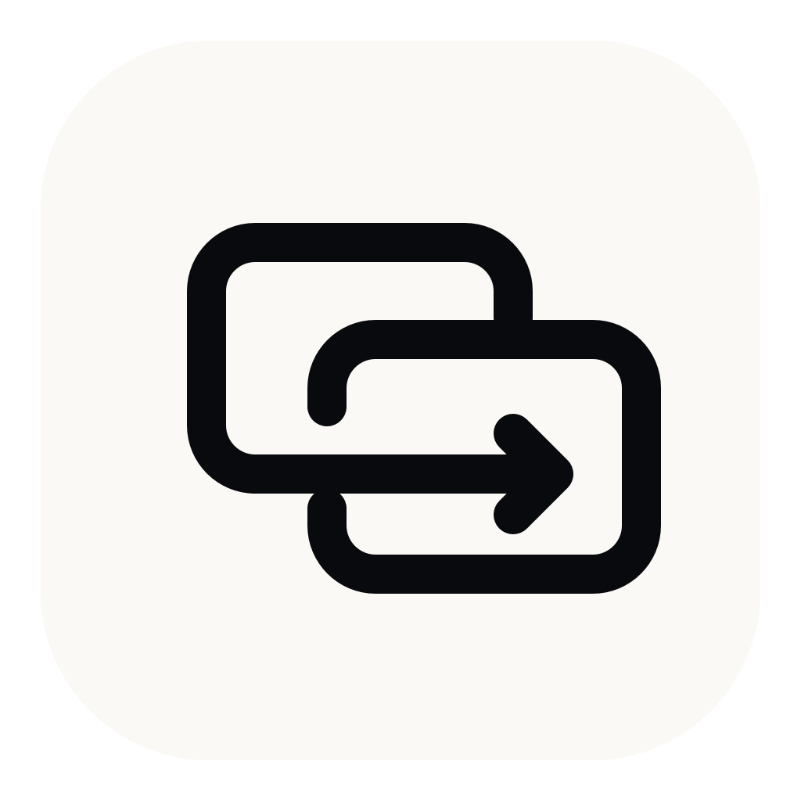

<div align="center">



# AlTab

An independent, community-maintained fork of [AltTab for macOS](https://github.com/lwouis/alt-tab-macos).

</div>

> [!IMPORTANT]
> This repository is not affiliated with or endorsed by the AltTab maintainers. Please report problems with this fork in [AlTab Issues](https://github.com/salasebas/altab/issues), not to the upstream project. There is **no** in-app updater. Optional GitHub Release binaries are **unsigned and not notarized** (Gatekeeper will warn); prefer building from source when you can.

## Current public milestone: 1.0.0

AlTab’s product version is **1.0.0** (independent of upstream AltTab’s `v11.x` line). Tag: **`altab-v1.0.0`**. Unsigned binary packaging includes a light **`.dmg`** for casual downloads (see the latest Release if this tag’s assets predate that).

- **Download (optional):** [GitHub Releases](https://github.com/salasebas/altab/releases) — prefer the latest `altab-v*` Release
  - **Casual:** `AlTab-<tag>-macOS-unsigned.dmg` — light drag-to-Applications image (**unsigned and not notarized**)
  - **Full package:** `AlTab-<tag>-macOS-unsigned.zip` (app + dSYM + notices), matching source tarball, manifest, notes, and `SHA256SUMS`
- **Supported path:** clone a tag (or `main`) and build locally with **Local Self-Signed** (stable permissions; not a distributable identity).

```bash
git clone https://github.com/salasebas/altab.git
cd altab
git checkout altab-v1.0.0   # or a later altab-v* tag
scripts/codesign/setup_local.sh   # once per Mac
scripts/build_local.sh
```

Versioning and redistribution details: [docs/releasing.md](docs/releasing.md).

## Direction

AlTab preserves AltTab's fast AppKit window-switching experience. Every locally implemented user-facing feature is available to everyone: Search, Search on Release, Auto size, App Icons and Titles, additional shortcuts, and per-shortcut options remain controlled by your preferences only.

There is no paid-access state, activation, trial, checkout, account, license Keychain path, or environment variable that unlocks features. Building from source is the supported way to run AlTab. Public binary signing, notarization, and a fork-owned update feed are tracked separately in [FORK.md](FORK.md) and are not required for local use.

## Run AlTab from source

You need a Mac with full [Xcode 26](https://developer.apple.com/xcode/) selected and Git. Command Line Tools alone are not enough. No Apple Account, provisioning profile, Team ID, Apple Development identity, or Developer ID identity is required for routine local builds.

The illustrated [building and troubleshooting guide](docs/building-and-troubleshooting.md) is the canonical walkthrough for selecting Xcode, understanding local signing, running Debug/Release builds, repairing Keychain state, and fixing macOS permissions.

### Quick start

```bash
git clone https://github.com/salasebas/altab.git
cd altab
scripts/codesign/setup_local.sh   # once per Mac (shared by every clone/worktree)
scripts/build_local.sh
```

`setup_local.sh` installs the canonical **Local Self-Signed** identity in the user Keychain, outside the repository. It is shared by every clone and worktree for that macOS user. `scripts/build_local.sh` builds and verifies an optimized native-architecture Release app, then prints its exact path and launch command:

```bash
open "DerivedData/Local/Build/Products/Release/AlTab.app"
```

Contributors should use `scripts/run_debug.sh` to build, install, and open the canonical `/Applications/AlTab Dev.app`. Pass `--universal` to `scripts/build_local.sh` only when one Release bundle must contain both `arm64` and `x86_64`.

### Permissions

| Permission | Required? | Purpose |
|---|---|---|
| **Accessibility** | Yes | Focus the window you select after releasing the shortcut. |
| **Screen Recording** | Optional | Show live window thumbnails and previews. |

The default `Local Self-Signed` identity lets these grants survive ordinary rebuilds. Screen Recording may be skipped with **Use the app without this permission. Thumbnails won’t show.** The visual recovery steps for stale or duplicate permission rows are in the [building and troubleshooting guide](docs/building-and-troubleshooting.md#example-3-repair-accessibility-and-screen-recording).

### Login item

AlTab can start at login through its own preference (**Settings → General → Start at login**). That setting only affects this fork's bundle identity (`dev.salasebas.AlTab` by default). It does not enable or disable official AltTab, and first-launch preference import does not copy login-item or permission state from AltTab.

### Signing

Interactive Debug and routine local Release use `Local Self-Signed`, installed once with `scripts/codesign/setup_local.sh`. It is not a distributable identity. The [canonical guide](docs/building-and-troubleshooting.md) covers the supported local workflow; [releasing.md](docs/releasing.md) covers redistribution artifacts and the current signing limitation.

### Updates

There is no Sparkle feed and no in-app updater. Update from source:

```bash
cd altab
git fetch origin --tags
git pull                  # or: git checkout altab-vMAJOR.MINOR.PATCH
scripts/build_local.sh    # setup_local.sh only if this Mac has never installed Local Self-Signed
open DerivedData/Local/Build/Products/Release/AlTab.app
```

If you copied `AlTab.app` elsewhere, replace that copy with the newly built app and relaunch. Preferences for the same bundle ID are preserved by macOS; a different signing identity or bundle ID can require re-granting permissions. Milestone tags and the versioning policy live in [docs/releasing.md](docs/releasing.md).

### Uninstall

Removing `AlTab.app` does not erase local state. Residuals for the default Release identity may include:

| Residual | Location |
|---|---|
| Preferences | `~/Library/Preferences/dev.salasebas.AlTab.plist` (and related CFPreferences) |
| Local usage counters (About UI only) | UserDefaults suite `dev.salasebas.AlTab.usage` |
| Login item | `~/Library/LaunchAgents/dev.salasebas.AlTab.plist` if **Start at login** was enabled |
| Permissions | Accessibility / Screen Recording grants for this code signature in System Settings |
| Local Self-Signed identity | Keychain entry from `scripts/codesign/setup_local.sh` — remove with `scripts/codesign/remove_local.sh` |

Debug builds use `dev.salasebas.AlTabDev` with the same pattern. AlTab never deletes official AltTab preferences (`com.lwouis.alt-tab-macos`), license suites, or Keychain items.

### Troubleshooting

Use the guide's [three visual examples](docs/building-and-troubleshooting.md#example-1-prepare-a-mac-and-run-the-right-app) and [decision table](docs/building-and-troubleshooting.md#troubleshooting-table). They cover Xcode selection, `Local Self-Signed`, Keychain errors, stale app copies, Accessibility, Screen Recording, and validation failures.

Do not disable Gatekeeper or other system-wide security protections, and never use upstream credentials or release infrastructure to make a local build run.

## Privacy

AlTab does not bundle or initialize Sparkle, AppCenter, crash reporting, analytics, or telemetry. It has no licensing, trial, checkout, or account network path and does not contact upstream services for feature access.

On first launch, AlTab may locally import compatible settings from the official AltTab defaults domain into missing AlTab keys. Existing AlTab choices win; unsupported and identity-specific state is skipped. AltTab's preferences, license data, and Keychain items are left untouched. Login-item and permission state are not transferred.

## Optional redistribution packaging

Official milestones ship **source only** (Git tag + release notes) unless a distributor intentionally attaches reviewed artifacts. Optional packaging tools (separate from the normal local build):

```bash
# Unsigned universal ZIP + exact source + checksums (no Apple credentials)
scripts/package_release.sh <tag-or-commit>

# Bring-your-own Developer ID + notarization (never silently falls back to unsigned)
scripts/package_notarized_release.sh <tag-or-commit> \
  --identity "Developer ID Application: Your Name (TEAMID)" \
  --team-id TEAMID \
  --bundle-id your.stable.bundle.id \
  --notary-profile YourNotaryProfile
```

GitHub Actions: manual workflow [Release packaging](.github/workflows/release.yml) with explicit `unsigned` or `notarized` mode. Configure the secrets documented in [docs/releasing.md](docs/releasing.md). Users must never be told to disable system-wide security protections.

## Relationship with upstream

This fork began at AltTab `v11.4.3` (`10af70aaaaac0a2dbb7d0aaa61cda21b065c203f`). The original Git history is retained so authorship and provenance remain visible.

Last reviewed upstream revision: AltTab `v11.4.4` (`081f3ee4014e03557c2ab39e9e168dac308fa49b`). Applicable reliability, capture, gesture, shortcut, Space, and tracked-window changes from that range are selectively integrated on `main`; AlTab is not automatically synchronized and may still lag behind future upstream work. See [UPSTREAM.md](UPSTREAM.md) for the commit matrix, deferred/skipped decisions, and integration policy.

## License and attribution

The application is licensed **GPL-3.0-only** ([GNU General Public License v3](LICENCE.md)). Distributions of modified binaries must satisfy the GPL's source and notice requirements. Copyright and provenance are summarized in [NOTICE.md](NOTICE.md), and third-party acknowledgments and license locations are in [docs/acknowledgments.md](docs/acknowledgments.md).

App Sandbox is disabled in this project (same retained entitlement as upstream). The supported binary channel—if you package one yourself—is direct distribution (unsigned with a warning, or Developer ID signed/notarized with your identity). Mac App Store distribution is not supported.

The AlTab icon used on this page comes from the maintainer's [earlier AlTab codebase](https://github.com/salasebas/altab-archived) and is separate from the upstream AltTab branding. Its provenance and license are recorded in [docs/brand/README.md](docs/brand/README.md).
