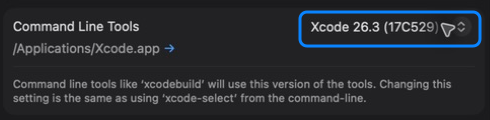
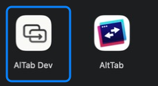
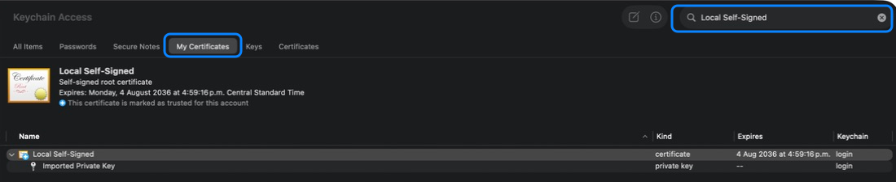
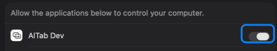
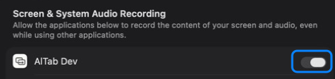

# Building and troubleshooting AlTab

This guide covers the supported source-build workflow: prepare one Mac, build a stable local app, grant its permissions, and recover from the failures contributors are most likely to see.

> [!IMPORTANT]
> Routine AlTab builds do **not** need an Apple Account, provisioning profile, Team ID, Apple Development identity, or Developer ID identity. They use the project-owned `Local Self-Signed` identity, installed once in the current user's Keychain. That identity is only for stable local execution; it is not suitable for redistribution.

## Choose a build path

| Goal | Command | Result |
|---|---|---|
| Daily development and QA | `scripts/run_debug.sh` | Builds, verifies, installs, and opens `/Applications/AlTab Dev.app`. |
| Optimized local use | `scripts/build_local.sh` | Produces `DerivedData/Local/Build/Products/Release/AlTab.app` and prints its exact path. |

Use `scripts/run_debug.sh` when changing or testing the app. Its canonical `/Applications` path keeps the Debug bundle ID, filesystem path, and signing requirement stable across Git worktrees. Use `scripts/build_local.sh` when you want the optimized Release app.

## Example 1: prepare a Mac and run the right app

### 1. Select full Xcode

AlTab requires full Xcode 26. Command Line Tools alone do not contain the SDK and build support needed by the project.

```bash
xcodebuild -version
```

If this reports that the active developer directory is a Command Line Tools instance, open **Xcode → Settings → Locations** and select the installed Xcode under **Command Line Tools**.



The equivalent system-wide command is:

```bash
sudo xcode-select -s /Applications/Xcode.app/Contents/Developer
```

To select Xcode for one build without changing the system-wide setting, use:

```bash
DEVELOPER_DIR=/Applications/Xcode.app/Contents/Developer scripts/run_debug.sh
```

Open Xcode once after installing or updating it so macOS can finish installing components and present any license that needs to be accepted.

### 2. Install the local identity once

From the repository root:

```bash
scripts/codesign/setup_local.sh
```

The helper creates and verifies `Local Self-Signed` in the current user's Keychain. It does not create an Apple account, enroll a development team, import a personal certificate, or write certificate material into the repository. Other clones and Git worktrees for the same macOS user reuse this identity.

### 3. Build and launch

For daily Debug/QA work:

```bash
scripts/run_debug.sh
```

The script safely replaces and opens the canonical copy shown below. Do not open an older `AlTab Dev.app` from another worktree's `DerivedData` directory.



For an optimized local Release build:

```bash
scripts/build_local.sh
open "DerivedData/Local/Build/Products/Release/AlTab.app"
```

Pass `--universal` only when one bundle must contain both `arm64` and `x86_64`. Native architecture is faster and is the normal local default.

### 4. Verify the result

For Debug/QA:

```bash
codesign --verify --deep --strict "/Applications/AlTab Dev.app"
codesign -d --verbose=4 "/Applications/AlTab Dev.app" 2>&1 \
  | sed -n '/^Authority=/p;/^TeamIdentifier=/p'
```

The routine path reports `Authority=Local Self-Signed` and no Team ID. `scripts/build_local.sh` performs equivalent signature, bundle-ID, architecture, entitlement, and fork-isolation checks for Release and prints a summary when they pass.

## Example 2: repair `Local Self-Signed`

The build preflight detects the common states: missing, invalid, incomplete, or duplicated identities.

```bash
scripts/codesign/preflight_local_signing.sh
security find-identity -v -p codesigning
```

In Keychain Access, choose **My Certificates**, search for the exact name `Local Self-Signed`, and expand the row. A complete identity contains the certificate and its private key. Do not remove Apple Development, Developer ID, or other personal identities with similar-looking certificate icons.



Use the repository helpers for safe recovery:

```bash
scripts/codesign/remove_local.sh
scripts/codesign/setup_local.sh
```

`remove_local.sh` asks before changing Keychain state. If it refuses because several exact matches exist, use the hashes printed by the script or Keychain Access to remove only the duplicate `Local Self-Signed` items, then run the setup helper again. Never paste Keychain passwords, private keys, `.p12` files, or notarization credentials into command arguments or issue reports.

If Keychain Access is locked, unlock the user's login Keychain in the app and retry. `User interaction is not allowed` and `errSecInternalComponent` usually mean the signing process could not access the private key or its trust state; they do not mean AlTab needs a Team ID.

If `/Applications/AlTab Dev.app` was signed by an older local identity, `scripts/run_debug.sh` intentionally refuses to replace it. Quit AlTab Dev, remove only that old app bundle from `/Applications`, and run the script again. The next section explains how to clean up stale permission rows afterward.

## Example 3: repair Accessibility and Screen Recording

AlTab uses two separate macOS permissions:

| Permission | Required? | Effect |
|---|---|---|
| Accessibility | Yes | Focuses the selected window after the switcher closes. |
| Screen Recording | No | Provides window thumbnails and previews. |

Open **System Settings → Privacy & Security → Accessibility** and enable the canonical `AlTab Dev` row.



Open **System Settings → Privacy & Security → Screen & System Audio Recording** and enable `AlTab Dev` when you want thumbnails. Older macOS versions call this panel **Screen Recording**.



After changing either permission, quit AlTab Dev completely and relaunch it. If a switch is already enabled but AlTab still reports denial:

1. Quit every AlTab Dev copy.
2. Remove stale or duplicate AlTab Dev rows from the relevant System Settings panel.
3. Run `scripts/run_debug.sh` so only `/Applications/AlTab Dev.app` launches.
4. Enable the new row and relaunch once more.

Screen Recording remains optional. In AlTab's permissions window, select **Use the app without this permission. Thumbnails won't show.** to use icon/title-only styles without repeated prompt-capable checks. Use the permissions button later when you intentionally want to retry.

## Troubleshooting table

| Symptom | Likely cause | Diagnostic | Safe fix | Do not proceed when… |
|---|---|---|---|---|
| `xcodebuild` says Command Line Tools are selected, or an SDK is missing | Full Xcode is not installed, selected, or fully initialized. | `xcode-select -p` and `xcodebuild -version` | Follow [Example 1](#example-1-prepare-a-mac-and-run-the-right-app). | The installed Xcode cannot provide the required macOS SDK. |
| `Signing for … requires a development team` | A local override or automatic Apple signing replaced the standard project settings. | Check `ALTAB_*` variables and ignored `config/local.xcconfig`. | Remove the unintended override and use `Local Self-Signed`. A Team ID is not required. | The proposed fix asks for upstream or third-party credentials. |
| Signing identity not found, duplicated, invalid, or incomplete | `Local Self-Signed` was never installed or its Keychain items are inconsistent. | `scripts/codesign/preflight_local_signing.sh` | Follow [Example 2](#example-2-repair-local-self-signed). | The exact identity cannot be distinguished safely from personal certificates. |
| `User interaction is not allowed` or `errSecInternalComponent` | The login Keychain is locked, the private key is inaccessible, or trust is inconsistent. | Inspect the expanded identity in Keychain Access. | Unlock the login Keychain, then use the repository removal/setup helpers. | A workaround asks for a password or private key in a command argument. |
| Permission is enabled but AlTab reports denial | The grant belongs to an old bundle, identity, or app path, or the app was not fully relaunched. | Confirm the running Debug app is `/Applications/AlTab Dev.app`. | Follow [Example 3](#example-3-repair-accessibility-and-screen-recording). | You cannot identify which app copy owns the permission row. |
| The wrong or an old app launches | A `DerivedData` product or old `/Applications` copy was opened directly. | Compare the running app path with the path printed by the build script. | Use `scripts/run_debug.sh`; for Release, use the exact printed path. | The app has an unexpected bundle ID or signing requirement. |
| Build output appears stale | A previous local build product is being reused. | Check the path and configuration printed by the script. | Remove only `DerivedData/Local` for Release or rebuild Debug normally. | Cleanup would target a directory broader than this repository's DerivedData. |
| A bundle guard, nested-signature, entitlement, or fork-isolation check fails | The built bundle is incomplete or contains unexpected configuration. | Read the first failing check from `scripts/build_local.sh` or `scripts/validate_ci.sh`. | Fix that source/configuration failure and rebuild from a clean local output. | Publishing would reuse upstream signing, update, analytics, licensing, or release infrastructure. |
| `pnpm`, `rg`, or SwiftFormat is missing | Full contributor validation was requested; these are not required merely to launch a local build. | `command -v pnpm rg swiftformat` | Install the pinned contributor dependencies described in [contributing.md](contributing.md#continuous-integration). | Tool versions differ from the versions pinned by CI. |

## Frequently asked questions

### Do I need an Apple Account, Team ID, or Developer ID?

No. The standard Debug and local Release paths use `Local Self-Signed` and leave the development team empty. Apple Development and Developer ID identities are advanced, explicit overrides for people who already manage those identities; they are not remediation steps for normal contributors.

### Why is any identity needed?

macOS privacy grants are associated with an app's code requirement, not just its display name. The stable local certificate gives rebuilt copies a consistent certificate-based designated requirement so macOS can recognize them across ordinary rebuilds.

### Should I use Debug or Release?

Use `scripts/run_debug.sh` while developing and testing. Use `scripts/build_local.sh` when you want the optimized local `AlTab.app`. They intentionally have different product names, bundle identifiers, and output locations.

### Can I share a compiled build?

Yes, but do not redistribute the `Local Self-Signed` app produced for your own Mac. Use the optional [redistribution packager](releasing.md#optional-redistribution-packaging), which creates a universal app ZIP, matching dSYM, exact source archive, build manifest, release notes, and checksums from an explicit tag or full commit. The current package is intentionally **unsigned and not notarized**, so label it that way and expect macOS Gatekeeper to warn or block it.

What does not exist yet is a trusted public binary release: the fork's official milestones remain source-only. Distribution without those warnings requires a fork-owned stable Developer ID identity, Apple notarization, and a tested release workflow, tracked in [issue #40](https://github.com/salasebas/altab/issues/40). Never reuse upstream credentials, Team IDs, update feeds, signing identities, or release infrastructure.

### What is safe to commit?

Tracked source, documentation, build configuration, and non-secret test fixtures are safe. Personal certificates, private keys, passwords, `.p12` files, Team IDs, notarization credentials, local Keychain state, and generated `config/local.xcconfig` are not.

## Related documentation

- [README](../README.md): supported product and source-milestone overview.
- [Contributing](contributing.md): development architecture and full validation dependencies.
- [Releasing](releasing.md): source-only milestone and optional redistribution rules.
- [Fork policy](../FORK.md): identity, infrastructure, and upstream-maintenance restrictions.
