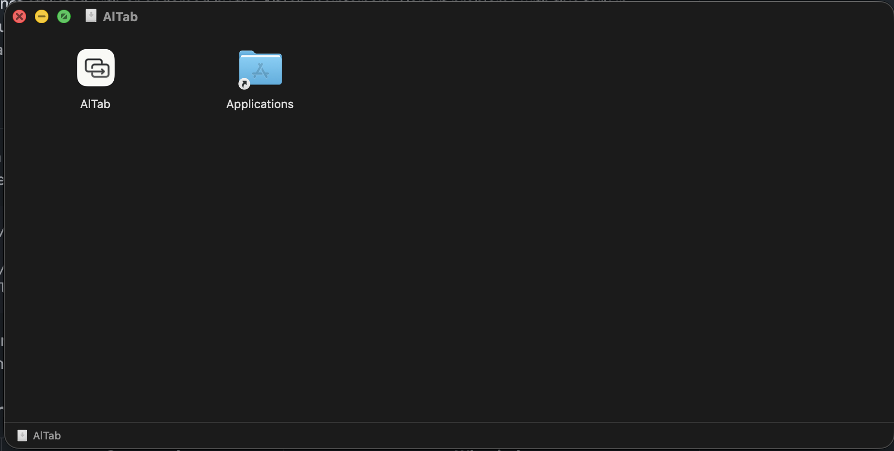
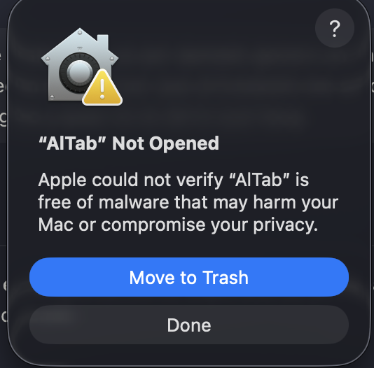
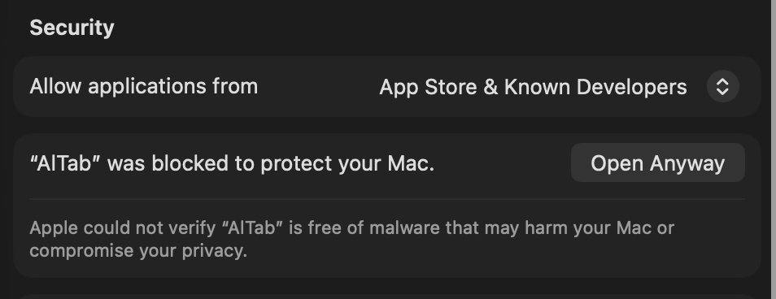
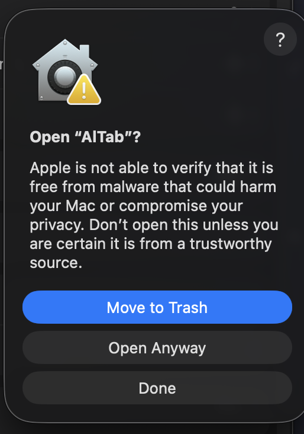
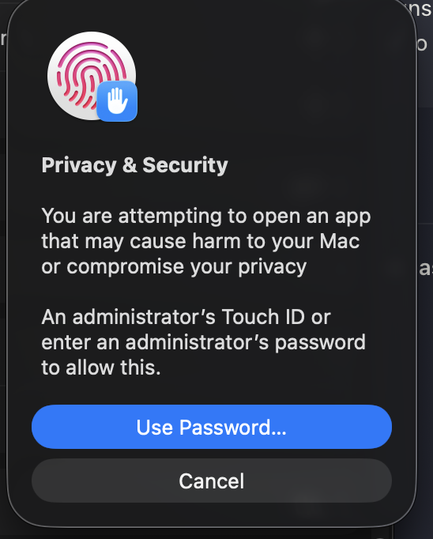
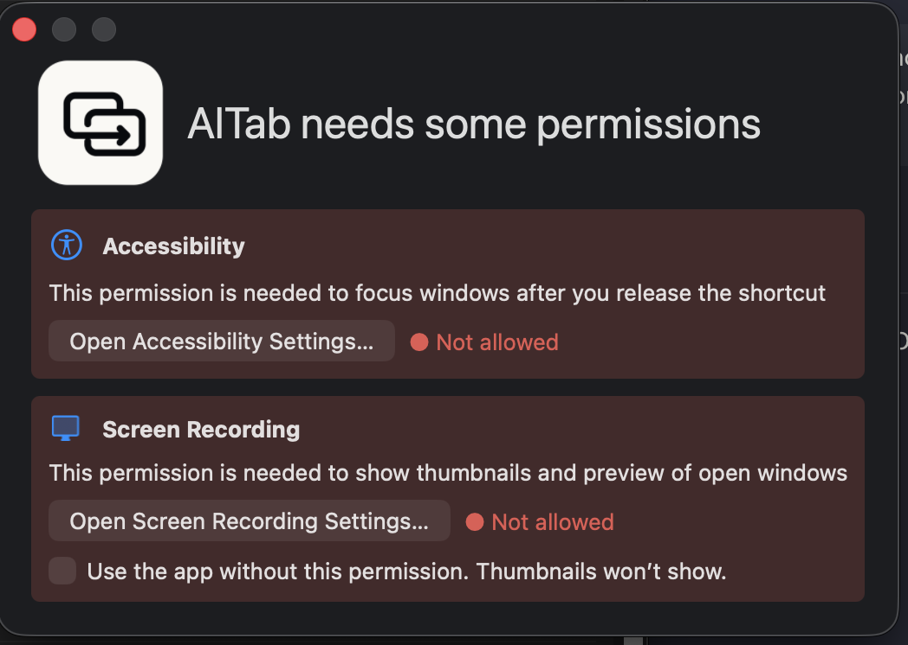

# Installing an unsigned AlTab release

Use this path when a GitHub Release includes `AlTab-<version>-macOS-unsigned.dmg` and you want to run AlTab without installing Xcode. Building from source remains the recommended path because its local certificate preserves macOS privacy grants across updates.

> [!WARNING]
> The download has a version-specific ad-hoc signature, but it has no Developer ID identity and is not notarized. Gatekeeper cannot verify its publisher or confirm that Apple scanned it for malware. Only continue when you obtained the DMG and checksum from the expected AlTab GitHub Release and trust that release.

The `unsigned` filename means “not signed by an Apple-recognized developer.” The ad-hoc bundle seal detects accidental changes and gives this exact build a code requirement for Accessibility and Screen Recording. It does not authenticate the publisher, satisfy Gatekeeper, or preserve permissions when the app changes.

## 1. Download and verify the DMG

From the release's **Assets**, download:

- `AlTab-<version>-macOS-unsigned.dmg`
- `SHA256SUMS`

Do not confuse the DMG with GitHub's automatic **Source code (zip)** and **Source code (tar.gz)** downloads.

In Terminal, verify the DMG from your Downloads folder:

```bash
cd ~/Downloads
grep 'macOS-unsigned\.dmg$' SHA256SUMS | shasum -a 256 --check
```

Continue only when the result ends with `OK`. A colocated checksum proves that the files agree with each other; it is not a substitute for obtaining the release through a channel you trust.

## 2. Copy AlTab to Applications

Open the DMG and drag **AlTab** onto the **Applications** shortcut. Launch only the copy at `/Applications/AlTab.app`; do not run the copy inside the DMG.



Before opening it, you can verify that the app has the complete version-specific seal required by the optional binary channel:

```bash
codesign --verify --deep --strict "/Applications/AlTab.app"
codesign -d -r- "/Applications/AlTab.app" 2>&1 | grep 'designated =>'
```

The first command is silent on success. The second reports a `designated => cdhash …` requirement. If either command says that the code object is not signed, the artifact predates this contract and cannot reliably receive macOS privacy permissions; remove that copy and build from source instead.

## 3. Allow this build through Gatekeeper

Open `/Applications/AlTab.app`. macOS first explains that Apple could not verify the app. Choose **Done**; do not move the app to Trash if you intend to continue.



Open **Apple menu → System Settings → Privacy & Security**, scroll to **Security**, and select **Open Anyway** beside the AlTab message. Apple makes this control available for about one hour after the blocked launch attempt.



Confirm **Open Anyway** in the second warning.



Authenticate with an administrator's Touch ID or password when macOS asks. Authentication happens entirely in System Settings; do not share the password with AlTab, a script, or an issue report.



This creates an exception only for this copy of AlTab. Do not disable Gatekeeper globally and do not remove quarantine attributes manually.

## 4. Grant AlTab's permissions

AlTab then shows its permissions window:



### Accessibility — required

1. Select **Open Accessibility Settings…**.
2. In **Privacy & Security → Accessibility**, enable **AlTab**.
3. If AlTab is missing, select **+** and choose `/Applications/AlTab.app`.
4. Quit AlTab completely and reopen `/Applications/AlTab.app`.

AlTab needs Accessibility to focus the selected window. It cannot finish starting without this permission.

### Screen Recording — optional

1. Select **Open Screen Recording Settings…**.
2. In **Privacy & Security → Screen & System Audio Recording**, enable **AlTab**.
3. Quit AlTab completely and reopen it so macOS refreshes the permission result.

Screen Recording provides live window thumbnails and previews. If you do not want to grant it, select **Use the app without this permission. Thumbnails won't show.**

## If a permission is enabled but AlTab still says “Not allowed”

A privacy row belongs to a code requirement, not merely the visible name `AlTab` or the bundle identifier. A row left by a source build, a previous unsigned release, or another app copy cannot authorize the current build.

For each affected permission:

1. Quit every running AlTab copy.
2. Open the relevant panel under **System Settings → Privacy & Security**.
3. Select the stale **AlTab** row and remove it with **−**.
4. Add `/Applications/AlTab.app` with **+**, then enable it.
5. Reopen `/Applications/AlTab.app`.

Do not remove `AlTab Dev` or the official `AltTab` row unless you intentionally want to reset those separate applications.

## Updating an unsigned release

An ad-hoc signature identifies one exact build. After replacing AlTab with a newer unsigned release, expect to repeat the Gatekeeper exception and privacy-permission steps. Preferences remain under the same bundle identifier, but Accessibility, Screen Recording, and login-item continuity are not guaranteed across unsigned builds.

For permissions that survive normal updates, use the [source-build installation](building-and-troubleshooting.md#example-1-prepare-a-mac-and-run-the-right-app), which creates a certificate-backed local identity once per Mac. A distributor who wants a conventional download that Gatekeeper recognizes must use their own Developer ID Application identity and Apple notarization as described in [Releasing](releasing.md#bring-your-own-developer-id-notarized-packaging).

## Troubleshooting

| Symptom | Safe next step |
| --- | --- |
| **Open Anyway** is absent | Try opening `/Applications/AlTab.app` once more, then return to **Privacy & Security → Security** within an hour. |
| `codesign` says `code object is not signed at all` | The binary cannot reliably use privacy permissions. Remove it and build from the matching source. |
| A permission switch is on but AlTab remains red | Quit AlTab, remove the stale row, add the exact `/Applications/AlTab.app`, enable it, and relaunch. |
| Screen Recording remains red immediately after enabling it | Quit and relaunch AlTab; the silent macOS preflight result can remain unchanged during the current process. |
| The DMG checksum does not match | Do not open the app. Delete the downloads and obtain both files again from the expected Release. |

Apple documents the per-app Gatekeeper exception in [Open an app by overriding security settings](https://support.apple.com/guide/mac-help/open-an-app-by-overriding-security-settings-mh40617/mac). Apple also explains why unsigned and ad-hoc code cannot preserve privacy decisions across builds in [TN3127: Inside Code Signing: Requirements](https://developer.apple.com/documentation/technotes/tn3127-inside-code-signing-requirements).
